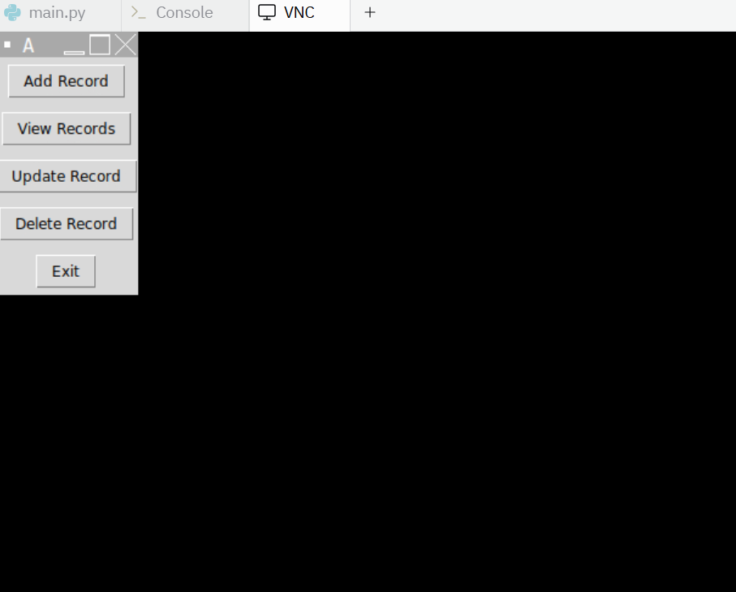
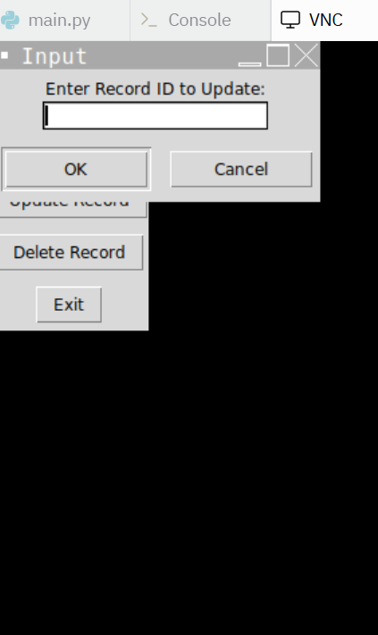
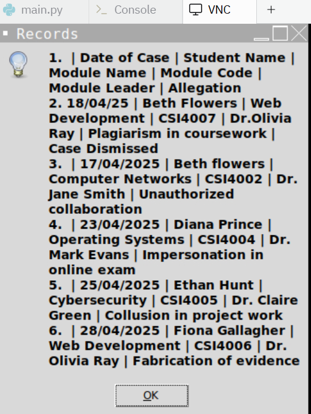

# Academic Misconduct Investigation (AMI) Management System

A GUI-based application built with **Python** and **Tkinter** to manage academic misconduct case records. The system provides a simple, menu-driven interface and stores data in a CSV flat-file format.

## 📌 Features
- Add, View, Update, Delete case records
- Data persistence via `ami_records.csv`

## ⚙️ Tech
Python (Tkinter), CSV

## 📸 Screenshots

**Main Menu**  

**Update Record Example**  

**View Records Example**  

